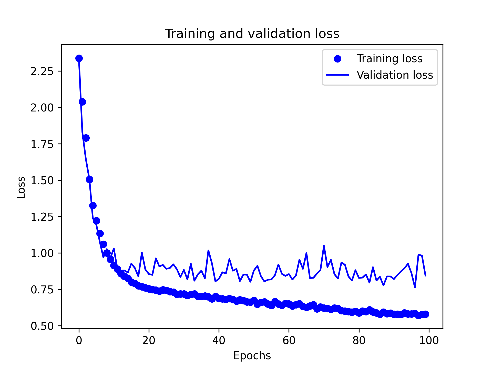
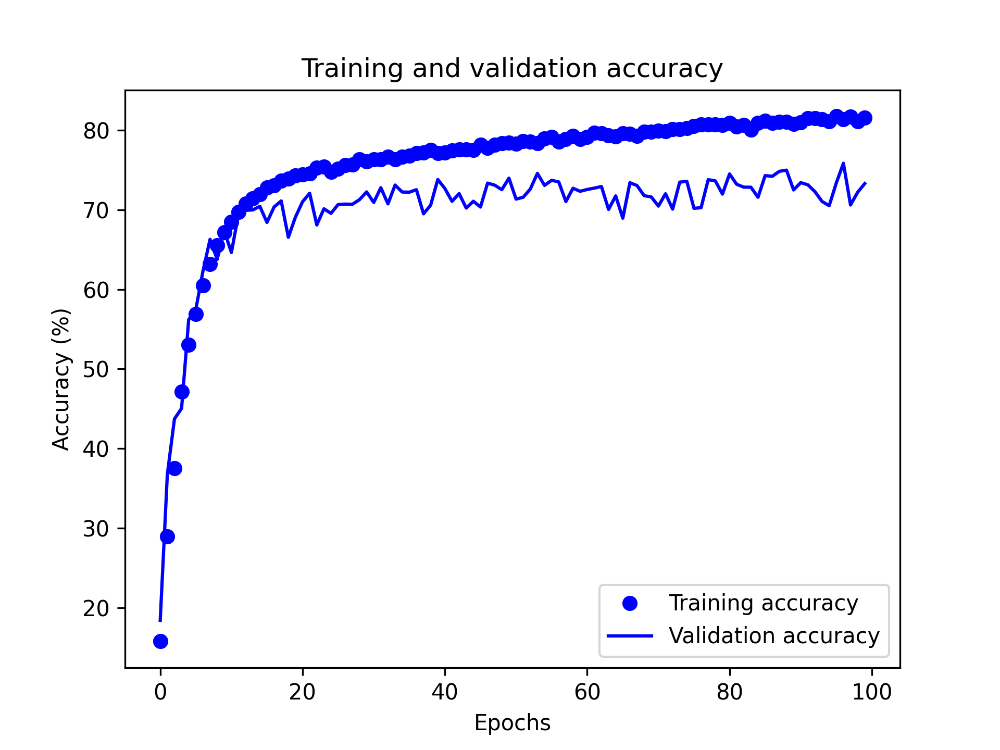
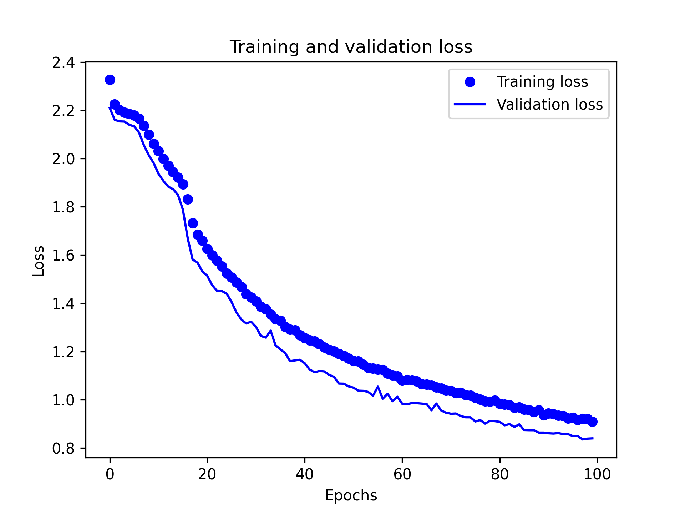
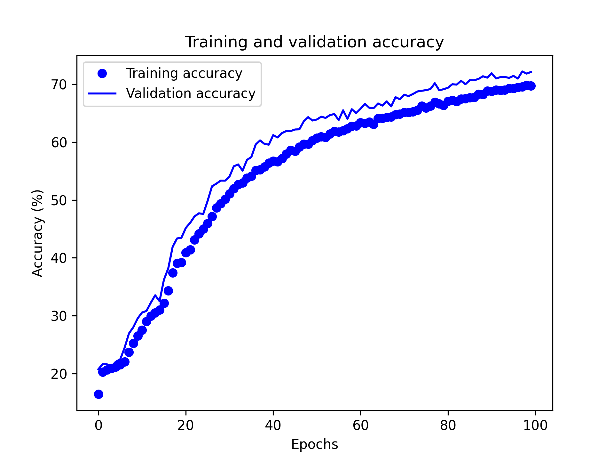

# Obfuscated multiclass classification

## Requirements

This code was tested on **Python 3.7**.

To install the required python pakages, please run:

```python
python3 -m pip install --no-cache-dir pipenv
python3 -m pipenv sync
```

To activate the virtual environment, please run:

```python
python3 -m pipenv shell
```

To remove the virtual environment, please run:

```python
python3 -m pipenv --rm
```

## Results

### 1D CONVNET with existing GloVe embeddings

After 100 epochs, the loss and accuracy for both training and validation have been obtained as follows:



### Bidirectional LSTM with existing GloVe embeddings

After 100 epochs, the loss and accuracy for both training and validation have been obtained as follows:


